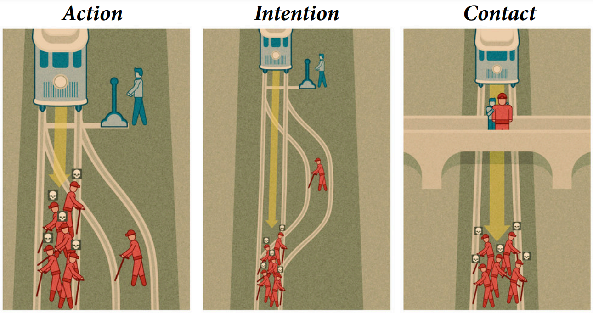

---
title: "Proyecto Final Métodos Analíticos"
output: html_document
date: "`r Sys.Date()`"
---

```{r setup, include=FALSE}
knitr::opts_chunk$set(echo = FALSE, warning = FALSE, message = FALSE)
```


```{r}
#install.packages(c("devtools","rstan","animation","ellipse","gt"))
#install.packages(c("coda","mvtnorm","devtools","loo","dagitty","shape"))
#devtools::install_github("rmcelreath/rethinking")
library(renv)
library(devtools)
library(rstan)
library(cmdstanr)
library(rethinking)
library(tidyverse)
library(stats)
library(ggplot2)
library(animation)
library(ellipse)
library(base)
library(dplyr)
library(stringr)
library(magrittr)
library(gt)
library(tidyverse)
library(DiagrammeR)
library(R.cache)
setwd("./sandbox_R/final_met_analit_mcd")

data(Trolley)
datos<-Trolley

```
## Planteamiento del problema y contexto.

El problema del tranvía es un dilema moral planteado originalmente por la filósofa inglesa Philippa Foot en 1967. Este problema consiste en que un agente puede accionar una palanca  que, de activarse, permite que un tranvía en movimiento cambie de vías. De no accionar la palanca, cinco individuos que están sobre las vías son arrollados por el tranvía, falleciendo. De accionar la palanca, fallece una sola persona, ubicada sobre las vías a las que se desvía el tranvía.

Las respuestas del agente en control de la palanca pueden variar de acuerdo al número de personas involucradas en el problema, el juicio moral del agente, entre otros factores. Con tal de dar respuesta a qué factores influyen sobre la decisión que toma el agente, los investigadores Fiery Cushman, Liane Young y Mare Hauser de la universidad de Harvard estudian el efecto de tres principios: 1) el de intención: el daño como objetivo es mayor al daño como daño colateral; 2) el de acción: el daño como acción es mayor al daño como omisión; 3) el de contacto: el daño físico es peor al daño no físico. Diversos investigadores se han preguntado si el juicio moral es  controlado o es un proceso automático (Bargh, 1999). El desarrollo  moral de los niños se enfoca en justificaciones más que en juicios (Kohlberg, 1969). La gente genera juicios morales al razonar sobre su propia justificación y si los juicios  morales surgen de un proceso auto cognitivo (Haidt. 2001).



No obstante, hay una falta de método experimental que  vincula los datos al juicio moral. El estudio de Harvard compara juicios entre algunos pares de escenarios variados para enfocarse en un factor a la vez. Este factor cuando varía produce juicios morales divergentes. Se estudiaron a personas de 37 años en promedio, 58% hombres, angloparlantes de EEUU, Canadá y Reino Unido, 25% tuvieron educación en 
filosofía moral. Cada uno recibió 32 escenarios morales separados en dos. Los sujetos los clasificaron en gravedad de la acción u omisión de 1 (prohibido) a 7 (obligatorio), justificando sus respuestas.

## Objetivando lo subjetivo

La previa clasificación del problema del tranvía lidia con una dificultad enorme: la subjetividad humana. Uno de los infinitos ejemplos de esto es la calificación que se le otorga a una película. Para mí, calificar una película con menos de 8 puede ser equivalente a, para ti, calificar una película con menos de 6. Realmente, consideramos a la película con la misma calificación abstracta, pero nuestra subjetividad lo está representando con distintosnúmeros dentro de la misma escala. ¿Cómo ajustamos esto?

```{r fig.show="hold", out.width="50%"}
ggplot(datos, mapping = aes(x = response)) +
  geom_bar() +
  theme_classic() +
  labs(x = "Respuesta", y = "Frecuencia")

ggplot(datos %>% group_by(response) %>% summarise(freq = n()) %>% mutate(acumulado = cumsum(freq)) %>% 
         mutate(prop_acum = round((acumulado / max(acumulado)) * 100, 2)), 
       mapping = aes(x = response, y = prop_acum)) +
  geom_col() +
  theme_classic() +
  labs(x = "Respuesta (Suma acumulada)", y = "Proporción acumulada")

```

Ya que tenemos la distribución con la cantidad de personas que asignaron cierto valor de gravedad moral, la transformamos a una distribución acumulada. Así, por ejemplo, la cantidad en 3 pasa de ser del número de personas que asignaron 3 a el número de personas que asignaron 3 o menos. Después, convertimos los valores netos de la distribución a proporciones. Así, cada valor posible de los siete tendrá su respectiva proporción, de tal modo que aquellos que están en el más alto valor (7 o menos en este caso) será el 100%. De estas siete proporciones obtenidas, le aplicamos la función *logit* para obtener las logit acumuladas. 
Ahora tenemos seis puntos de corte (el séptimo tiende a infinito), donde la entrada $x$ de dichos puntos es lo que se obtuvo con *logit* y la entrada $y$ es la proporción. Gracias a esto, podemos expresar la probabilidad de que se asigne uno de los valores clasificatorios como si fuera proveniente de una distribución continua (cuando antes se trataba como discreta), donde ahora la probabilidad de 
que alguien elija el valor $x$ es la probabilidad acumulada de que elija $x$ menos la probabilidad acumulada de que elija $x-1$. Dicho de otro modo, ahora esa probabilidad se mide como la diferencia entre ese punto de corte y el anterior. Por último, añadimos una variable compensatoria en forma de función lineal $\phi_i=\beta x_i$ de tal modo que, finalmente, podemos declarar que las respuestas se distribuyen OrderedLogit$(\phi_i,\alpha)$, donde $\alpha$ es el vector de los puntos de corte.


```{r}
grViz("
digraph {
  graph [ranksep = 0.2]
  node [shape=plaintext]
  edge [minlen = 3]
    X -> R
    S -> R
    E -> R
    Y -> R
    G -> R
    Y -> E
    G -> E
}
")
```

Donde:

- R (response): es el jucio de si es adecuado o no
- X (treatment): es si hay acción, intención o contacto
- S (story): el planteamiento de la historia puede ser la configuración de que hay un tranvía y hay                 personas o animales por ejemplo. Esto puede afcetar la respuesta de los participantes.
Los aspectos de la persona que hace el juicio:
- Y (age)
- E (education)
- G (gender)

Tanto la respuesta (R) como el tratamiento (X) son alateorios y se puede medir el efecto directo causal de ambos. Pero los aspectos de la persona que hace el juicio no son aleatorios. Estos variables están relacionados unas con otras causalmente, ya que la edad de un individuo influencía su nivel de educación y la socialización que tiene un género influencía su nivel de educación.

Sin embargo, el modelo anterior es tomando en cuenta muestras voluntarias y estas variables que se pueden medir de los individuos (edad, género y educación) están asociadas con *participación*, es decir, la edad, el género y el nivel de educación son razones para participar en un estudio científico. Esto nos lleva a agregar la variable *P* de participación en el diagrama DAG como sigue:


```{r}
grViz("
digraph {
  graph [ranksep = 0.2]
  node [shape=plaintext]
  P [color=blue]
  edge [minlen = 3]
    X -> R
    S -> R
    E -> R
    Y -> R
    G -> R
    Y -> E
    G -> E
    G -> P 
    Y -> P 
    E -> P 
}
")
```

La variable Participación es implícitamente condicionada, ya que nuestra muestra ya está seleccionada por participación así que si estratficaramos la muestra con esta variable y excluimos a todas las personas que no participan, no podríamos observar a estos últimos. Por lo tanto, *P* es un colisionador y dado que está condicionado a Y, X y G, asociación fluye a través de ella y todas las variables que describen el comportamiento individual y covarían a través del colisionador *P*. Esto implica que no es posible medir el efecto causal total de la variable Género pero sí podemos medir el efecto directo. No es posible medir porque tenemos estos caminos no causales a através de participación. Sin embargo, si estratificamos por edad y educación al mismo tiempo que estratificamos por género podemos estimar un efecto directo.  

## Problema del tranvía (trolley problem)

Descripción de variables.

case: Identifica la historia que se presento a los sujetos, cada una tiene una combinación diferente de tratamientos (*string*)

response: Juicio de los participantes sobre qué tan apropiado es tomar una acción en la historia (*categorical*: 1: Prohibido a 7: Obligatorio)

order: Orden en que las historias se presentaron al participante (*integer*)

id: Identificador del participante (*factor*)

age: Edad del participante en años (*integer*)

male: Género del participante, hombre es igual a 1, mujer a 0

edu: Nivel educativo más alto alcanzado por el participante

action: Código para el tratamiento "acción" en la historia (1) o inacción (0)

intention: Código para el tratamiento "intención" (1) o "ausencia de intención" (0)

contact: Código para el tratamiento "contacto" (1) o "ausencia de contacto" (0)

story: Etiqueta que identifica los escenarios (*factor*)

action2: Codificación alternativa de la acción que es la unión de las variables action y contact

La base de datos consiste de 331 individuos a los que se les presentaron 30 escenarios con diferentes combinaciones de acción, intención y contacto. Por tanto, la base tiene 9930 observaciones.

Estructura de variables
```{r}
str(datos)
```

Estructura de variables
```{r}
summary(datos %>% select(where(is.numeric)))

```

No hay NAs
```{r}
is.na(datos) %>% head() %>% apply(2,sum)
```


# Variables de caracteres

Se observa que la base de datos tiene 30 diferentes tipos de caso. La base de datos está balanceada para esta variable; esto es, cada caso tiene 331 observaciones.

```{r}
ggplot(datos %>% group_by(case) %>% summarise(count = n()) %>% arrange(count), 
       mapping = aes(x = reorder(case, count), y = count)) +
  geom_col() +
  theme_classic()
```

La variable educación está desbalancieada en favor de grado bachelor's, some college y master's principalmente.

Educación superior
```{r}
ggplot(datos %>% group_by(edu) %>% summarise(count = n()) %>% arrange(count), 
       mapping = aes(x = reorder(edu, count), y = count)) +
  geom_col() +
  theme_classic() +
  labs(x = "NIvel educativo", y = "Frecuencia")
```

57% de los encuestados son hombres
```{r}
datos %>% pull(male) %>% table()
```

50% de los encuestados tiene 36 años o menos, mientras que la persona mayor es de 72 años. 

```{r}
quantile(datos$age)
```
```{r}
ggplot(datos, aes(x = age)) +
  geom_histogram(binwidth = 4) +
  theme_classic() +
  labs(x = "Edad", y = "Frecuencia")
```

Respecto a las variables de tratamiento, el 43% de los escenarios mostrados tuvo acción igual a 1, el 47% intención igual a 1, y el 20% contacto igual a 1. 

```{r}
datos %>% summarise(action = round(mean(action) * 100, 2),
                    intention = round(mean(intention) * 100, 2), 
                    contact = round(mean(contact) * 100, 2)) %>% t() %>% as.data.frame()  %>% 
  rename(Prop. = V1) %>% gt(rownames_to_stub = TRUE)
```

## Expresión analítica de densidad de probabilidad de log-probabilidades categóricas ordenadas (*Ordered categorical log-odds probability density* en inglés)

Sea Y la respuesta tal que $ Y = 1,2,...,J $, con probabilidades asociadas $ \pi_1,\pi_2,...,\pi_j $.

La probabilidad acumulada de respuesta menor o igual a j es:

$$ P(Y \leq j) = \pi_1 + ... + \pi_j $$

Entonces, el modelo cumulativo logit está definido como:

$$ \frac{P(Y \leq j)}{P(Y > j)} = \frac{P(Y \leq j)}{1 - P(Y \leq j)} = log\frac{\pi_1+...+p_j}{\pi_{j+1}+...+\pi{J}}$$

Lo cual son los log-odds de que ocurra $Y \leq j$

## Modelo Stan

Los autores plantean variantes de tres modelos: 1) un modelo básico donde 
la respuesta está en función de la acción, intención y contacto; 2) un modelo  donde se añaden variables de educación y edad, y 
3) un modelo donde se añade una variable aleatoria Dirichlet 

```{r}
#renv::restore()
N<-nrow(datos)
edu_levels <- c( 6 , 1 , 8 , 4 , 7 , 2 , 5 , 3 )

data_list <- list(
    "N" = N,
    "K" = 7,
    "R" = datos$response,
    "A" = datos$action,
    "I" = datos$intention,
    "C" = datos$contact,
    "G" =datos$gender,
    "E" = edu_levels[ datos$edu ],
    "Y" = standardize(datos$age)
)
```

```{r}


destino_dir<-"final_ma/"
ruta_1 <- file.path("final_ma/trolley_stan_1.stan")
modelo_1 <- cmdstan_model(ruta_1, dir=destino_dir)
ruta_2 <- file.path("final_ma/trolley_stan_2.stan")
modelo_2 <- cmdstan_model(ruta_2, dir=destino_dir)
ruta_3 <- file.path("final_ma/trolley_stan_dirichlet.stan")
modelo_3 <- cmdstan_model(ruta_3, dir=destino_dir)

```
```{r}
muestras_1 <- modelo_1$sample(data = data_list, 
                          chains = 3, 
                          iter=1500, 
                          iter_warmup=500, 
                          seed=483892929, 
                          refresh=500) %>% saveCache(pathname="final_ma/")

```

```{r}
precis(loadCache(muestras_1),2)
```

```{r}
muestras_2 <- modelo_2$sample(data = data_list, 
                          chains = 3, 
                          iter=1500, 
                          iter_warmup=500, 
                          seed=483892929, 
                          refresh=500) %>% saveCache(pathname="final_ma/")
```
```{r}

precis(muestras_2,2)
```

```{r}
data_list$G1 <- ifelse(data_list$G==1,1,0)
data_list$G2 <- ifelse(data_list$G==2,1,0)

datos1<-datos %>% filter(male==1)
datal_list_female<-list( "N" = N,
    "K" = 7,
    "R" = datos1$response,
    "A" = datos1$action,
    "I" = datos1$intention,
    "C" = datos1$contact,
    "G" =datos1$male,
    "E" = edu_levels[datos1$edu],
    "Y" = standardize(datos1$age)

)

muestras_3_male <- modelo_3$sample(data = data_list_female, 
                          chains = 3, 
                          iter=1500, 
                          iter_warmup=500, 
                          seed=483892929, 
                          refresh=500) %>% saveCache(pathname="final_ma/")


```
```{r}
precis(loadCache(muestras_3),2)
```


## Referencias

- Cushman, F., Young, L., & Hauser, M. (2006). The role of 
conscious reasoning and intuition in moral judgment: 
Testing three principles of harm. *Psychological science*, 1082-1089
- Stan User's Guide. Ordered logistic regression and probit regression, 
https://mc-stan.org/docs/2_23/stan-users-guide/ordered-logistic-section.html
